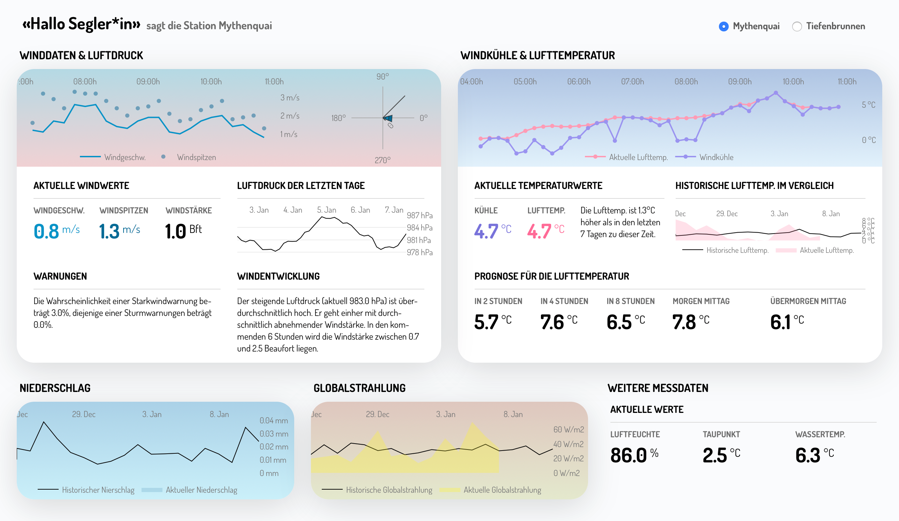

# Weather station for sailors

## Getting Started

### Installation on a Raspberry Pi

Make sure that Python 3.6+ is installed on your Raspberry Pi.
If not, follow the instructions on [this Medium article](https://medium.com/@isma3il/install-python-3-6-or-3-7-and-pip-on-raspberry-pi-85e657aadb1e).

Clone the repo then install the requirements for the weatherstation with pip3

```
$ git clone https://github.com/fabianjordi/fhnw-ds-hs2019-weatherstation
$ cd fhnw-ds-hs2019-weatherstation
$ pip3 install -r requirements.txt
```

Make sure you have influxDB installed **and running** on your Raspberry Pi.
You may follow the following instructions: [http://blog.centurio.net/2018/10/28/howto-install-influxdb-and-grafana-on-a-raspberry-pi-3/](http://blog.centurio.net/2018/10/28/howto-install-influxdb-and-grafana-on-a-raspberry-pi-3/)

Import the data from the CSVs and the API into influxDB:
```
python3 import_data.py
```

Wait till the import sleeps for 600 seconds.
In another terminal run the app with:

```
$ cd wetterstation
$ python3 import_data.py
```
You may get an error saying the numpy c-extentions failed.
Please consider https://stackoverflow.com/questions/58868528/importing-the-numpy-c-extensions-failed to fix this issue.
After uninstalling numpy reinstall it via the requirements-installation as explained above.

Wait till the import sleeps for 600 seconds.
In **another terminal** run the app with

```
# new Terminal
$ cd fhnw-ds-hs2019-weatherstation/wetterstation
$ python3 app.py
```

You may get an ImportError for file libf77blas.so.3.
Follow the instructions on https://github.com/Kitt-AI/snowboy/issues/262 to fix this issue.

Open chromium and go to 127.0.0.1:**8050**.
Then press F11 to enter the fullscreen mode.


## About the app

This app displays weather data from the "Mythenquai" and the "Tiefenbrunnen" weather stations.
There is a station switcher at the top right of the app to update the graphs below.
Selecting or hovering over data in a plot will update the other plots ('cross-filtering').

## Notebooks

The documentation is saved as a Jupyter Notebook and as a PDF file as well.
You can find them in
 [Challenge_HS19C5_Wettermonitor_Dokumentation.ipynb](Notebook/Challenge_HS19C5_Wettermonitor_Dokumentation.ipynb)
 and [Challenge_HS19C5_Wettermonitor_Dokumentation.pdf](Notebook/Challenge_HS19C5_Wettermonitor_Dokumentation.pdf) respectively.

Under the [test folder](Notebook/tests) you can find some Jupyter Notebooks that were used to create the functions for the forecasts as well as
some files that were created for learning (or trial and error) purposes.

## Screenshot
### Dashboard

The dashboard shows some current weather data as well as some forecasts



You can find the documentation in [Beschreibung_Visualisierungen](/docs/Beschreibung_Visualisierungen.md).
You may also have a look at the queries and database structure documentation in [Database_Structure_Queries](/docs/Database_Structure_Queries.txt).

## Built With

- [Dash](https://dash.plot.ly/) - Main server and interactive components

## Authors
- Fabian Jordi ([fabian.jordi@students.fhnw.ch](fabian.jordi@students.fhnw.ch))
- Simon Luder ([simon.luder@students.fhnw.ch](simon.luder@students.fhnw.ch))
- Roman Studer ([roman.studer1@students.fhnw.ch](roman.studer1@students.fhnw.ch))
